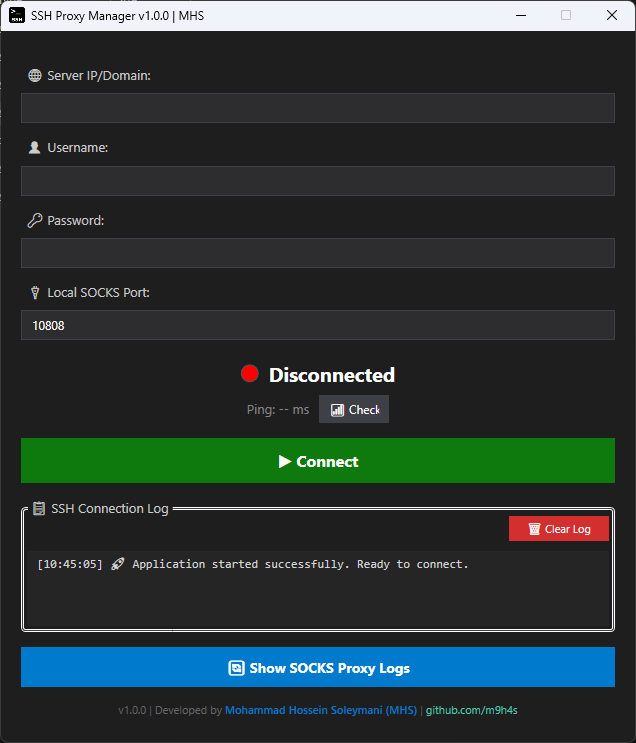
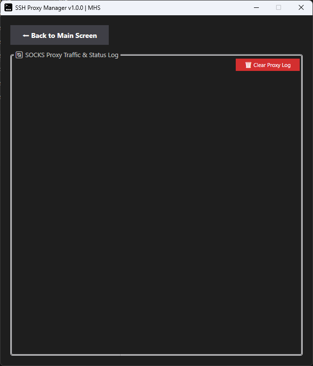

# 🛡️ SSH Proxy Manager

### یک تونل SSH و پروکسی SOCKS5 سبک، سریع و امن برای ویندوز و لینوکس

**[English Documentation (Soon)]()** | **[گزارش باگ / Issues](https://github.com/m9h4s/SSHProxyManager/issues)**

---

## 📑 فهرست مطالب
- [معرفی پروژه](#-معرفی-پروژه)
- [ویژگی‌های کلیدی](#-ویژگیهای-کلیدی)
- [تصاویر محیط برنامه](#-تصاویر-محیط-برنامه)
- [دانلود و نصب](#-دانلود-و-نصب)
- [راهنمای استفاده و تنظیم پروکسی](#-راهنمای-استفاده)
  - [استفاده در ویندوز و لینوکس](#۱-اتصال-به-سرور)
  - [تنظیم در تلگرام](#۲-تنظیم-پروکسی-در-تلگرام)
  - [تنظیم در مرورگرها](#۳-تنظیم-پروکسی-در-مرورگرها-chrome--firefox)
- [امنیت و حریم خصوصی](#-امنیت-و-حریم-خصوصی)
- [راهنمای توسعه‌دهندگان (Build)](#-راهنمای-توسعهدهندگان-build-from-source)
- [نقشه راه (Roadmap)](#-نقشه-راه-roadmap)
- [مشارکت در پروژه](#-مشارکت-در-پروژه)
- [درباره سازنده و مجوز](#-درباره-سازنده)

---

## 📌 معرفی پروژه

**SSH Proxy Manager** یک اپلیکیشن دسکتاپ بومی، سبک و کاملاً مستقل است که به شما اجازه می‌دهد تنها با وارد کردن مشخصات سرور لینوکسی (VPS) خود، محدودیت‌های شبکه را دور بزنید. این برنامه به صورت خودکار:
1. یک **تونل امن SSH** بین سیستم شما و سرور برقرار می‌کند.
2. یک **پروکسی محلی SOCKS5** (به صورت پیش‌فرض روی پورت `10808`) ایجاد می‌کند تا ترافیک برنامه‌های مختلف را از آن عبور دهید.

| سیستم عامل | فریم‌ورک | رابط کاربری | نوع خروجی فایل اجرایی |
|------|---------|-------------|-------------|
| 🪟 **Windows** | WPF (.NET 8) | XAML بومی ویندوز | Single File (بدون نیاز به نصب) |
| 🐧 **Linux** | Avalonia UI (.NET 8) | Fluent Dark Theme | Single File (مستقل) |

---

## ✨ ویژگی‌های کلیدی

- 🎨 **رابط کاربری مدرن:** طراحی Dark Mode چشم‌نواز، ساده و به دور از پیچیدگی.
- ⚡ **اتصال سریع یک‌کلیکی:** برقراری تونل و پروکسی در کسری از ثانیه (Dynamic Port Forwarding).
- 💾 **ذخیره خودکار پروفایل:** نگهداری IP، نام کاربری و رمز عبور در فایل کانفیگ محلی.
- 📶 **مانیتورینگ زنده پینگ:** بررسی وضعیت پایداری و تاخیر اتصال به سرور (Manual & Auto).
- 📋 **سیستم لاگ دوگانه:** 
  - مانیتورینگ دقیق وضعیت SSH (خطاها، اتصال و قطعی).
  - مانیتورینگ زنده ترافیک اتصالات پروکسی SOCKS5.
- 📦 **بدون نیاز به پیش‌نیاز (Self-Contained):** فایل‌های نهایی نیازی به نصب بودن محیط .NET روی سیستم کاربر ندارند و به صورت پرتابل (Portable) اجرا می‌شوند.

---

## 📸 تصاویر محیط برنامه

### 💻 نمای اصلی (Main View)

  

<i>مدیریت سرور، مشاهده پینگ و لاگ‌های اتصال SSH</i>

### 🔄 نمای لاگ پروکسی (Proxy Log View)

  

<i>رصد لحظه‌ای برنامه‌هایی که در حال استفاده از پروکسی هستند</i>

---

## ⬇️ دانلود و نصب

شما می‌توانید آخرین نسخه اجرایی و آماده استفاده را بر اساس سیستم‌عامل خود از بخش **[Releases](https://github.com/m9h4s/SSHProxyManager/releases)** دانلود کنید.

1. **برای ویندوز:** فایل `.zip` را دانلود و استخراج کرده و روی `SSHProxyManager.exe` کلیک کنید.
2. **برای لینوکس:** فایل `.tar.gz` را دانلود و استخراج کنید. سپس در ترمینال با دستور `chmod +x SSHProxyManager` به آن دسترسی اجرایی داده و آن را اجرا کنید.

---

## 🚀 راهنمای استفاده

### ۱. اتصال به سرور
1. برنامه را باز کنید.
2. آدرس سرور (IP/Domain)، نام کاربری (معمولاً `root`) و رمز عبور سرور لینوکسی خود را وارد کنید.
3. پورت SOCKS را روی `10808` تنظیم کنید (یا پورت دلخواه).
4. روی دکمه **Connect** کلیک کنید تا چراغ وضعیت سبز شود.

### ۲. تنظیم پروکسی در تلگرام (Telegram)
برای عبور دادن ترافیک تلگرام از این تونل امن:
1. در تلگرام به مسیر `Settings > Advanced > Connection type` بروید.
2. روی `Use custom proxy` کلیک کرده و **SOCKS5** را انتخاب کنید.
3. در فیلد Server مقدار `127.0.0.1` و در فیلد Port مقدار `10808` را وارد کنید.
4. ذخیره کنید تا تلگرام متصل شود.

### ۳. تنظیم پروکسی در مرورگرها (Chrome / Firefox)
برای اینکه کل مرورگر از این پروکسی استفاده کند، پیشنهاد می‌شود از افزونه‌های مدیریت پروکسی مانند **SwitchyOmega** یا **FoxyProxy** استفاده کنید:
- پروتکل: `SOCKS5`
- سرور (Server): `127.0.0.1`
- پورت (Port): `10808`

---

## 🔒 امنیت و حریم خصوصی

- برنامه پس از اولین اجرای موفق، فایل `config.json` را کنار فایل اجرایی می‌سازد تا اطلاعات شما را برای دفعات بعد ذخیره کند. 
- ⚠️ **هشدار:** رمز عبور سرور شما به صورت متن خام در این فایل ذخیره می‌شود. لطفاً از این فایل محافظت کرده و آن را در گیت‌هاب یا فضاهای عمومی منتشر نکنید.
- برای اطلاعات بیشتر در خصوص گزارش باگ‌های امنیتی، فایل [SECURITY.md](SECURITY.md) را مطالعه فرمایید.

---

## 💻 راهنمای توسعه‌دهندگان (Build from Source)

اگر می‌خواهید این پروژه را توسعه دهید یا خودتان از روی سورس کد کامپایل کنید، سیستم شما باید مجهز به **.NET 8.0 SDK** باشد. 
برای مشاهده راهنمای قدم‌به‌قدم کامپایل، به داکیومنت‌های زیر مراجعه کنید:

- 🪟 [راهنمای کامپایل نسخه ویندوز](docs/BUILD_WINDOWS.md)
- 🐧 [راهنمای کامپایل نسخه لینوکس](docs/BUILD_LINUX.md)

---

## 🗺️ نقشه راه (Roadmap)

ویژگی‌هایی که در نسخه‌های بعدی به برنامه اضافه خواهند شد:
- [ ] پشتیبانی از اتصال با کلیدهای خصوصی (SSH Key / PEM / PPK) به جای رمز عبور.
- [ ] امکان ذخیره و سوئیچ سریع بین چندین پروفایل سرور مختلف.
- [ ] قابلیت Minimize شدن برنامه در System Tray (کنار ساعت ویندوز).
- [ ] دکمه "تنظیم خودکار پروکسی کل سیستم (System Proxy)" با یک کلیک.
- [ ] رمزنگاری فایل کانفیگ برای جلوگیری از افشای رمز سرور.

---

## 🤝 مشارکت در پروژه

پروژه‌های متن‌باز با کمک جامعه توسعه‌دهندگان زنده می‌مانند! اگر پیشنهادی دارید، باگی پیدا کرده‌اید یا می‌خواهید کدی اضافه کنید:
1. پروژه را Fork کنید.
2. یک Branch جدید برای تغییرات خود بسازید (`git checkout -b feature/NewFeature`).
3. تغییرات را Commit کنید (`git commit -m 'Add NewFeature'`).
4. تغییرات را Push کنید (`git push origin feature/NewFeature`).
5. یک **Pull Request** ثبت کنید.

---

## 👨‍💻 درباره سازنده

پروژه با ❤️ و اشتیاق توسعه یافته توسط **محمدحسین سلیمانی (MHS)**

## 📜 مجوز (License)

این پروژه تحت مجوز **MIT** منتشر شده است. استفاده از این ابزار کاملاً رایگان بوده و توسعه‌دهنده مسئولیتی در قبال نحوه استفاده کاربر نهایی از این تونل شبکه‌ای ندارد. برای جزئیات کامل به فایل [LICENSE](LICENSE) مراجعه کنید.